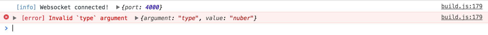

# browser-logger

A dead simple logger, designed to be perfect for the browser.

---

### Features

- No configuration necessary—with sane defaults based on your `NODE_ENV` and `LOG_LEVEL` variables.
- Makes your logging nice and easy to read in development.
- Only logs errors by default in production, so user's won't see junk in the console.
- Leverages the browser's smart, built-in `console` formatting and stack traces.

---

### Example

Given an API which is what you'd expect...

```js
import logger from 'browser-logger'

logger.info('Websocket connected!', { port: 4000 })
logger.error('Invalid `type` argument', { argument: 'type', value: 'nuber' })
```

In development, it outputs an easy to read version, using the browser's built-in formatting...



And in production it will only log errors by default, to not confuse users who might open the console.

That's it!

---

### Why?

The default `console` behavior in most browsers these days has a nice API, with great support for different data types and stack traces. But things get noisey without some control over the "log level".

Unfortunately most of the browser-focused logging libraries aren't great—they're bloated in size, or they use `console.log` which doesn't add stack traces for errors, or they're overly complex to setup.

I wanted a super-simple logger for the browser, with sane defaults.

That way you can just import `'browser-logger'` and not have to worry about configuring things at all.

---

### API

```js
import logger from 'browser-logger'

logger.info('message', { key: 'value' })
```
```
[info] message { key: 'value' }
```

The package exports the one-liner `logger` singleton as the default, which is already instanciated with sane defaults using the `NODE_ENV` environment variable and the `LOG_LEVEL` Local Storage variable.

#### LOG_LEVEL

```js
localStorage.setItem('LOG_LEVEL', 'warn')
```

To change the level of logs that are output, set the Local Storage `LOG_LEVEL` variable. (Or you can do it via your browser's developer tools UI.)

If you want to completely disable logging, set `LOG_LEVEL` to `'none'`.

#### new Logger(options)

```js
import { Logger } from 'browser-logger'

const logger = new Logger({
  level: String,     // Defaults to `LOG_LEVEL` if set, or `'info'`.
  prefix: String,    // Defaults to `''`.
})
```

If you need to create multiple instances, which can be useful for subclassing loggers based on the parts of your system, the `Logger` constructor is also exported, which takes the following options:

- `level` sets the current log threshold, silencing logs that don't meet it.
- `prefix` sets a string that will be prepend to every message.

#### logger\[level\](message, data)

```js
logger.info('message', { key: 'value' })
logger.error('error!', { code: 400 })
```
```
[info] message key=value level=info message=message
[error] error! code=400 level=error message=error!
```

Log a `message` with `data` to the console at `level`, where level is one of:

- `trace`
- `debug`
- `info`
- `warn`
- `error`
- `fatal`

You can also pass an `Error` object as a `message`, in which case the logger will automatically convert it into useful `message` and `data` with a full stack trace.

#### logger.log(level, message, data)

```js
logger.log('info', 'message', { key: 'value' })
```
```
[info] message key=value level=info message=message
```

Log a `message` with `data` to the console at `level`.

#### logger.clone(options)

```js
const other = logger.clone({ prefix: '[package] ' })

other.info('message', { key: 'value' })
```
```
[info] [package] message key=value level=info message=message
```

Create a new `Logger` instance, copying the existing loggers config, but extending it with optional `options`.
